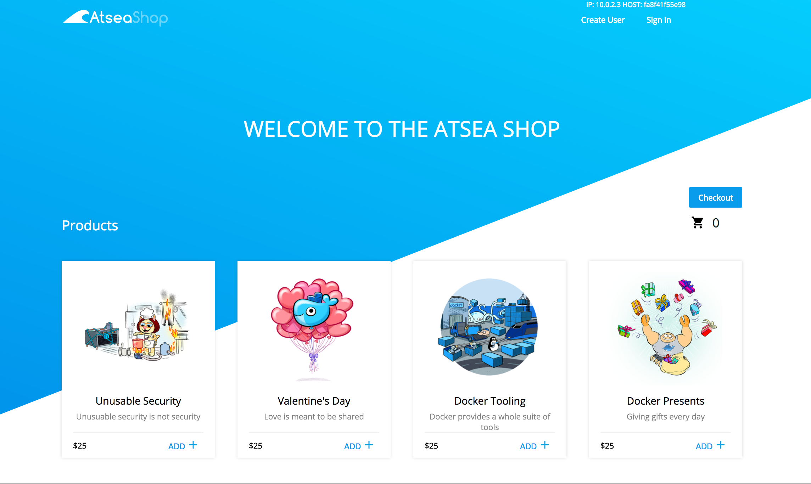

#  Aplicativo de demonstração da Loja Atsea

A Loja AtSea é um aplicativo de demonstração composto por: 

* Aplicativo Java REST escrito usando Spring-Boot, 
* um banco de dados para inventário de produtos, dados do cliente e pedidos,
* um carrinho de compras React,
* um proxy NGINX reverso implementando https,
* um gateway de pagamento para simular a gestão de certificados

# Requisitos

Este exemplo usa recursos do Docker 17.05 CE Edge. Instale esta versão para executar o exemplo.

# Construindo e Executando a Loja AtSea

## Segredos

Este aplicativo usa segredos do Docker para proteger os componentes do aplicativo. O proxy reverso requer a criação de um certificado que é armazenado como um segredo e o pagamento também requer uma senha armazenada como segredo. Para criar um certificado e adicionar como um segredo:

```
mkdir certs

openssl req -newkey rsa:4096 -nodes -sha256 -keyout certs/domain.key -x509 -days 365 -out certs/domain.crt

docker secret create revprox_cert certs/domain.crt

docker secret create revprox_key certs/domain.key

docker secret create postgres_password certs/domain.key
```

Para criar um segredo para a realização do gateway de pagamento:

```
echo staging | docker secret create staging_token - 
```

## Executar como um aplicativo

Para executar a loja AtSea como um aplicativo:
```
docker-compose up --build
```

## Implantar em um swarm
```
# Se você precisa criar um Swarm
docker swarm init
docker stack deploy -c docker-stack.yml atsea
```

## Um ambiente de desenvolvimento simplificado
Esse compose file cria um ambiente de desenvolvimento simplificado que consiste apenas no servidor de aplicativos e no banco de dados.

```
docker-compose --file docker-compose-dev.yml up --build
```


## O AtSea Shop 

A URL do conteúdo é `http://localhost:8080/`

# REST API

Documentação para chamadas REST: [REST API](./REST.md)

